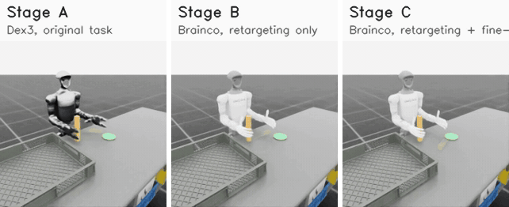
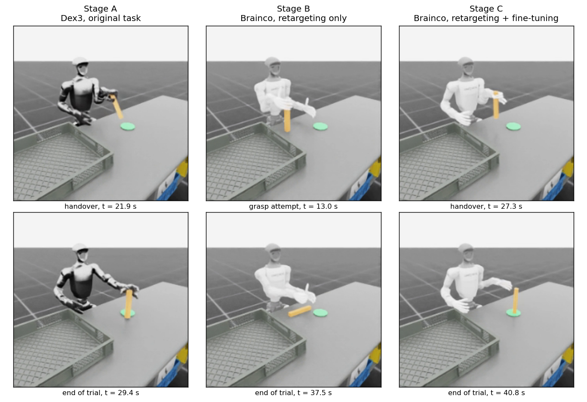

<h1 align="center">Dex3 to Brainco Revo2 hand transfer on a Unitree G1</h1>

<p align="center">
  Bimanual handover with NVIDIA GR00T N1.7-3B in Isaac Lab: replace the robot's hands,
  retarget the policy, then recover the task with simulation fine-tuning.
</p>

<p align="center">
  
  
  
  
  
</p>

<p align="center">
  
</p>

<p align="center"><sub>
  The same trial, same object, same start position, run in the three required stages.
  Stage A hands the stick over and stands it on the target. Stage B never closes a grasp.
  Stage C hands over and places it after fine-tuning. Played at four times real speed.
</sub></p>

## What this is

Assignment 1 of a robotics take-home: Dex-to-Brainco hand retargeting and simulation fine-tuning
on a Unitree G1_29DoF with a fixed base. The task is the handover the assignment gives as an
example: the right hand grasps an upright stick, passes it to the left hand without teleportation,
releases, and the left hand places it on a target. Assignment 2, the advanced one, asks for a
technical pipeline rather than code, and is answered in
[docs/assignment2_pipeline.md](docs/assignment2_pipeline.md).

The starting policy is `nvidia/GR00T-N1.7-3B`. Its vision-language backbone stays frozen
throughout; a new embodiment slot, the projector and the flow-matching action head carry all
task-specific behaviour. The three required runs are:

| stage | robot | policy | result |
|:--|:--|:--|:--|
| **A** | G1 + Dex3 | GR00T N1.7 fine-tuned on 98 scripted Dex3 demonstrations | **8 / 50** |
| **B** | G1 + Brainco Revo2 | the Stage A policy with a Dex3-to-Brainco retargeting layer, no training | **0 / 50** |
| **C** | G1 + Brainco Revo2 | the Stage A policy fine-tuned on 44 scripted Brainco demonstrations | **10 / 50** |

Five configurations per stage, ten trials each: three stick sizes, one held-out object shape and
one held-out start position. Held-out totals are 2/20 for Stage A, 0/20 for Stage B and 2/20 for
Stage C.

<p align="center">
  
</p>

## Why retargeting alone fails

Stage B never completes a grasp, in any configuration, and an open-loop replay of the Dex3
demonstrations through the same mapping is also 0 of 10. So the failure is in the hand mapping
rather than in the policy.

The retargeted command closes the thumb swing, the thumb bend and the finger curl together. The
Revo2 thumb starts pointing up, so its tip travels down from 11 cm above the finger plane and
reaches finger height only at the end of the stroke, after the fingers have already curled past a
3 cm stick, knocking it over on the way. The grasp used for the Stage C demonstrations swings the
thumb across first, so it closes in the same plane the fingers curl in.

<p align="center">
  
</p>

## Results

<p align="center">
  
</p>

- Full metric table (M1 to M6): [results/results_table.md](results/results_table.md)
- One row per trial: [results/trials.csv](results/trials.csv)
- Wrist and fingertip tracking error: [results/tracking_error.md](results/tracking_error.md)
- Plots: [success per configuration](results/plots/success_by_configuration.png),
  [how far trials get](results/plots/task_progress_by_stage.png),
  [training loss](results/plots/training_loss.png)
- Labelled video of every trial, 150 in all, plus one reel per stage:
  [latest release](https://github.com/sudarshan-sridhar/g1-dex3-to-brainco-handover/releases/latest)

Fine-tuning recovers what the hand swap destroys and reaches about the level of the Dex3
reference. With ten trials per cell and a sampling action head, one or two successes of
difference between cells is noise; the collapse from A to B and the recovery from B to C are not.

## Documents

| document | contents |
|:--|:--|
| [Technical report](docs/technical_report.md) | what was retained, frozen, retargeted, replaced and fine-tuned, with results, failure analysis and limitations |
| [Architecture](docs/architecture.md) | policy, retargeting layer, simulator, observations, actions, controllers and the evaluation loop |
| [Hand models](docs/hand_models.md) | Dex3 and Revo2 degrees of freedom, limits, actuation, sensing, and how the hand was replaced in the asset |
| [Correspondence](docs/correspondence.md) | joint, fingertip, palm, wrist, contact, observation and action mapping |
| [Source policy and provenance](docs/provenance.md) | checkpoint, code commit, licenses and every material modification |
| [Sim-to-real plan](docs/sim_to_real_plan.md) | calibration, control rate, latency, safety limits, staged hardware validation |
| [Assignment 2 pipeline](docs/assignment2_pipeline.md) | the written pipeline for the bonus assignment |

## Models

Both checkpoints are public, with the configuration needed to reproduce the evaluation:

- Stage A, Dex3: [huggingface.co/Sudarshan18/gr00t-n17-g1-dex3-handover](https://huggingface.co/Sudarshan18/gr00t-n17-g1-dex3-handover)
- Stage C, Brainco Revo2: [huggingface.co/Sudarshan18/gr00t-n17-g1-brainco-handover](https://huggingface.co/Sudarshan18/gr00t-n17-g1-brainco-handover)

## Reproduce

Two machines are assumed: one that runs Isaac Lab and one with a GPU for training and serving the
policy. They can be the same machine if it has enough GPU memory.

**Environment.** Isaac Lab 2.3.2 on Isaac Sim 5.1, Python 3.11
([env/isaaclab_requirements.txt](env/isaaclab_requirements.txt)) for the simulator.
Python 3.12 with Isaac-GR00T at commit `51d4c89`
([env/gr00t_requirements.txt](env/gr00t_requirements.txt)) for training and
inference.

**Robot asset.** Clone the official description and convert it once:

```bash
git clone https://github.com/unitreerobotics/unitree_ros assets_brainco/unitree_ros
git -C assets_brainco/unitree_ros checkout 7d6075f
python scripts/convert_brainco_urdf.py          # writes assets_brainco/usd/g1_29dof_brainco.usd
```

**Demonstrations, datasets, training, evaluation.**

```bash
# 1. scripted demonstrations (simulator machine)
DEMO_ARGS="$(cat configs/demo_args_dex3.txt)"    STAGE=A bash scripts/generate_demos.sh data/demos_dex3    5
DEMO_ARGS="$(cat configs/demo_args_brainco.txt)" STAGE=C bash scripts/generate_demos.sh data/demos_brainco 3

# 2. LeRobot datasets (drops episodes with failed camera renders, pairs each frame with the next command)
bash scripts/build_dataset.sh A data/demos_dex3    lerobot_dex3_handover
bash scripts/build_dataset.sh C data/demos_brainco lerobot_brainco_handover

# 3. fine-tuning (GPU machine), about 3.5 h and 2.2 h on one A40
sbatch -A <account> -p <gpu_partition> slurm/finetune_stage_a.sbatch
sbatch -A <account> -p <gpu_partition> slurm/finetune_stage_c.sbatch

# 4. serve a checkpoint, then forward the port to the simulator machine
sbatch -A <account> -p <gpu_partition> \
  --export=ALL,CKPT=<checkpoint>,MODCFG=scripts/dex3_handover_config.py,PORT=5601 slurm/policy_server.sbatch
ssh -N -L 5601:<gpu node>:5601 <login host>

# 5. evaluation, 5 configurations x 10 trials per stage
bash scripts/evaluate_stage.sh A dex3    none            5601 10
bash scripts/evaluate_stage.sh B brainco dex3_to_brainco 5601 10
EXTRA="--max-steps 1050" bash scripts/evaluate_stage.sh C brainco none 5612 10

# 6. table, plots and labelled videos
python scripts/make_results_table.py
python scripts/label_videos.py
```

## Layout

| path | contents |
|:--|:--|
| `scripts/` | scene and demonstration generator, retargeting layer, dataset conversion, policy server, evaluation client, analysis tools |
| `slurm/` | fine-tuning and policy-serving jobs |
| `configs/` | the exact demonstration-generator arguments used for each hand |
| `env/` | package lists for both environments |
| `docs/` | report, architecture, hand models, correspondence, provenance, sim-to-real plan, bonus pipeline |
| `results/` | metric table, per-trial CSV, plots, training loss histories, checkpoint provenance |
| `media/` | figures used in this README |

## Licenses

GR00T code is Apache-2.0 and the GR00T N1.7 weights are under the NVIDIA Open Model License.
The Brainco G1 description comes from `unitreerobotics/unitree_ros` (BSD-3-Clause). Versions and
licenses of everything used are listed in [docs/provenance.md](docs/provenance.md).
