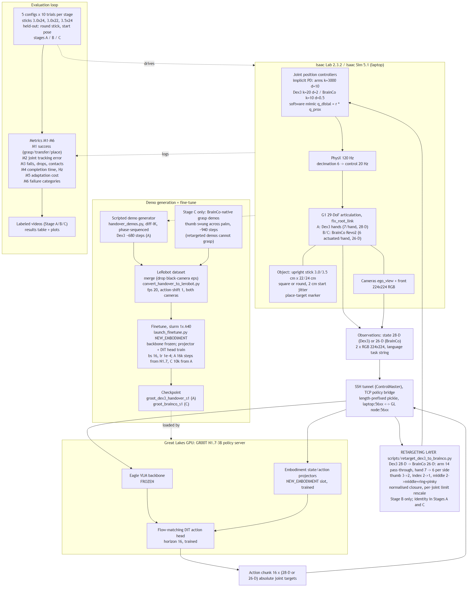

# System architecture

The diagram source is [architecture.mmd](architecture.mmd) (Mermaid).

## Simulator

Isaac Lab 2.3.2 on Isaac Sim 5.1. One environment holds a Unitree G1_29DoF with a fixed pelvis, a
packing table, the object and a target marker. Physics runs at 120 Hz; the policy runs at 20 Hz,
so each action is held for six physics steps.

The robot is either the stock G1 with Dex3 hands (28 action values: 14 arm joints, 14 hand joints)
or the same robot with Brainco Revo2 hands (26 values: 14 arm joints, 12 actuated hand joints).
The five distal hand joints per hand follow their proximal joint through the linkage ratio in the
model file, written in software every step.

Joint position targets drive implicit PD actuators: arms at stiffness 3000 and damping 10, the
Dex3 hands at the gains Isaac Lab ships, and the Revo2 hands at stiffness 10, damping 0.5 and an
effort cap of twice the motor rating in the URDF.

Two 224x224 RGB cameras are rendered: a head camera on the robot and a fixed front camera.

## Policy

`nvidia/GR00T-N1.7-3B` runs on a GPU machine behind `scripts/policy_server.py`, which takes an
observation (two images, the joint state and the task sentence) and returns the next 16 joint
targets. Requests are length-prefixed pickles over one TCP socket, tunnelled over SSH when the
simulator and the GPU are on different machines. The Eagle vision-language backbone is frozen; the
projector and the flow-matching action head, including the state and action encoders of the new
embodiment slot, carry the task.

## Retargeting layer

Used only in Stage B, on the simulator side: the Dex3 28-value action is converted to the Brainco
26-value action by normalised closure, and the Brainco state is converted back to the 28-value
layout the policy expects. Joints, fingertips, palm and wrist frames, contacts, observations and
actions are mapped in [correspondence.md](correspondence.md).

## Demonstrations and training

`scripts/handover_demos.py` records scripted demonstrations with differential IK on each arm and a
closure schedule for the hands. `scripts/build_dataset.sh` merges them into a LeRobot v2 dataset,
dropping episodes whose cameras failed to render and pairing every observation with the next
command. The Slurm jobs in `slurm/` fine-tune the policy and serve a checkpoint.

## Evaluation loop

`scripts/evaluate_stage.sh` runs one simulator process per configuration: five configurations,
ten trials each, for each stage. Every trial records the staged outcome (grasp, handover, place),
drops, object impacts, joint-limit violations, timing and the achieved control rate, then
`scripts/make_results_table.py` turns those files into the metric table, the per-trial CSV and the
plots, and `scripts/label_videos.py` writes one labelled video per trial.
