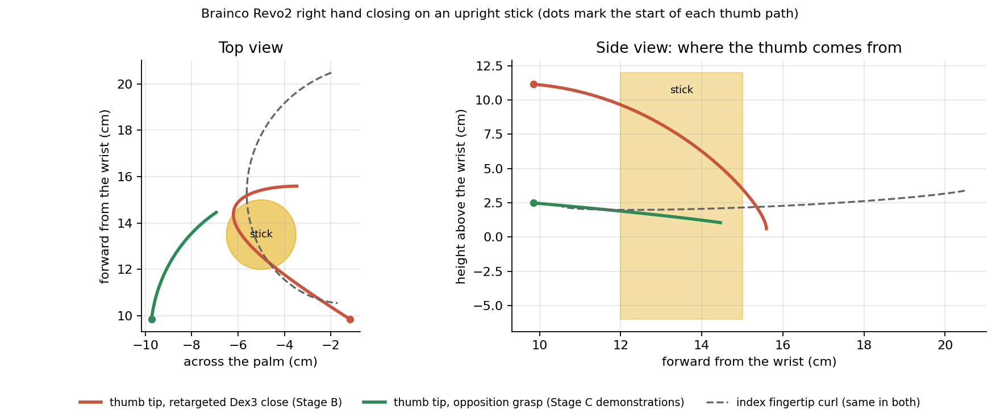
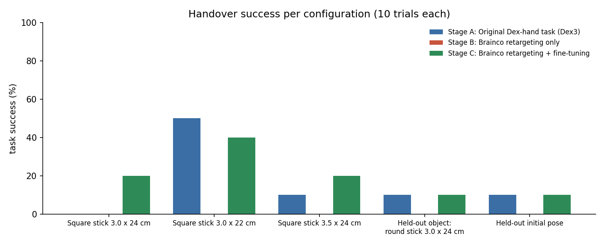
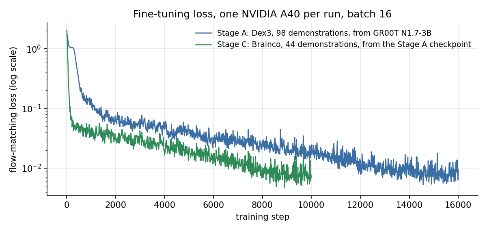

# Technical report

Dex-to-Brainco hand retargeting and simulation fine-tuning on a Unitree G1_29DoF, with
NVIDIA GR00T N1.7-3B as the starting policy. Everything here runs in simulation. Nothing
was run on hardware.

## 1. Task and setup

The robot is a Unitree G1_29DoF with a fixed base, standing at a table. The task is the
bimanual handover from the assignment: the right hand grasps an object, transfers it to the
left hand without teleportation, the right hand releases, and the left hand places the object
at a target.

The object is an upright square stick, 3.0 x 3.0 x 24 cm, 50 g, standing on the table, with a
target marker about 28 cm away on the robot's left. The stick was chosen by measurement rather than
preference. With the wrist orientation the arm can hold across this workspace, the Dex3 closes
its three fingers in a roughly horizontal plane, so it wraps an upright object and cannot wrap a
flat or horizontal one. Earlier candidates (a steering wheel, a horizontal bar, a cube) were
rejected for that reason.

Simulation is Isaac Lab 2.3.2 on Isaac Sim 5.1. Physics runs at 120 Hz and the policy at 20 Hz
(decimation 6). Observations are two 224x224 RGB cameras (a head camera and a fixed front
camera), joint positions, and a fixed task sentence. Actions are absolute joint position targets:
14 arm joints plus 14 Dex3 hand joints (28 values), or 14 arm joints plus 12 Brainco actuated
joints (26 values). The policy predicts 16 steps at a time and the simulator executes the chunk
before asking for the next one.

A trial counts as a success only if, in order: the object rises at least 5 cm while the right
hand holds it; the right hand then moves away while the left hand holds it; the object comes to
rest within 12 cm of the target with both hands clear; and, at the final frame, the stick still
rests there on its own. "On its own" means the stick is upright (tilt below 15 degrees) or lying
flat (above 75 degrees) and no fingertip or wrist is within 3 cm of it. The last check was added
after reviewing videos of an earlier evaluation, where a stick leaning against the fingers passed
(section 8).

## 2. Source policy: what is retained, frozen, replaced and fine-tuned

The starting checkpoint is `nvidia/GR00T-N1.7-3B` (Hugging Face revision
`2fc962b973bccdd5d8ce4f67cc63b264d6886495`), run with NVIDIA Isaac-GR00T at commit
`51d4c89f72fda44cbf77285c6a8114b52676b8a1`. Its pretraining mixes real robot teleoperation
(including a G1 with Dex3 hands), open datasets and simulation. Its G1 entry uses 7 values per
hand, a wrist end-effector pose and arm joints, at a control rate that is not documented in the
checkpoint.

| part | treatment |
|---|---|
| Eagle vision-language backbone | frozen in every stage |
| backbone-to-head projector | trained |
| flow-matching action head (DiT), including the new embodiment's state and action encoders | trained |
| base weights | never modified; the checkpoint file is unchanged |

All task-specific behaviour lives in a `NEW_EMBODIMENT` slot with its own modality config
(`scripts/dex3_handover_config.py` for the Dex3 layout, `scripts/brainco_config.py` for Brainco)
and dataset statistics recomputed per dataset. Training used a learning rate of 1e-4, batch 16,
and state dropout 0.05.

The three required runs:

| stage | robot | policy | retargeting layer |
|---|---|---|---|
| A | G1 + Dex3 | GR00T N1.7 fine-tuned on scripted Dex3 handover demonstrations | none |
| B | G1 + Brainco Revo2 | the Stage A policy, unchanged | Dex3 28-D to Brainco 26-D, applied at inference |
| C | G1 + Brainco Revo2 | the Stage A policy fine-tuned on scripted Brainco demonstrations | none |

## 3. Hand replacement

Everything below `left_wrist_yaw_link` and `right_wrist_yaw_link` is replaced with the Brainco
Revo2 hands from the official Unitree description
(`unitree_ros/robots/g1_with_brainco_hand/g1_29dof_mode_15_brainco_hand.urdf`, BSD-3-Clause,
commit `7d6075f`), converted to USD by `scripts/convert_brainco_urdf.py`. Link masses, inertias,
collision meshes, joint axes, limits and the distal transmissions come from that file. The 29 body
joints above the wrists are identical to the Dex3 model, so the arms are untouched.

Details, including the fixes the conversion needs and the actuator settings, are in
[hand_models.md](hand_models.md). The short version: the Revo2 has five fingers with six motors
per hand (thumb swing, thumb bend, and one bend per finger), the distal joints follow their
proximal joint through a linkage, and ten degenerate tip joints in the file have to be rewritten
as fixed or the physics engine snaps four of them to 1 rad on the first step.

## 4. Source-to-target correspondence

The full table for joints, fingertips, palm and wrist frames, contacts, observations and actions
is in [correspondence.md](correspondence.md), generated from the code that implements it.

The mapping is by normalised closure. For every Dex3 joint, closure is how far it has travelled
from its open value toward its closed value; each Brainco joint is then commanded to the same
fraction of its own range. Seven Dex3 joints per hand become six Brainco joints: the Dex3 thumb
yaw drives the Revo2 thumb swing, the two Dex3 thumb bends average into the Revo2 thumb bend, the
two Dex3 index joints average into the index, and the two Dex3 middle joints drive the middle,
ring and pinky together. Arm joints pass through unchanged, and wrist targets are unchanged, which
is what exposes the hand mismatch cleanly.

## 5. Retargeting only (Stage B)

Stage B is 0 successes in 50 trials, and the retargeted hand never completes a grasp in any
configuration. Replaying the scripted Dex3 demonstrations open-loop on the Brainco robot through
the same mapping also gives 0 of 10, so the failure is in the hand mapping, not in the policy.

The reason is the shape of the closing motion, not the amount of closure. The Revo2 thumb starts
pointing up, away from the palm. The retargeted command closes the thumb swing, the thumb bend and
the finger curl together, so the thumb tip travels down from 11 cm above the finger plane and only
arrives at finger height at the very end of the stroke, by which time the fingers have curled past
a 3 cm stick. On the way down it crosses the space the stick occupies and pushes it over. The
fingers alone cannot hold the stick either: their closed loop is wider than 3 cm, so they ring it
without squeezing.

Measured from the official model, in the right wrist frame with the stick drawn where the working
grasp holds it. Solid red is the retargeted closing motion, solid green is the grasp used for the
Stage C demonstrations, and the dashed grey line is the index fingertip, which curls the same way
in both.

Three smaller mismatches add to it: one Dex3 command drives three Revo2 fingers, so the ulnar
side of the hand closes earlier than the Dex3 middle finger did; the Revo2 fingers reach 2 to
4 cm further along the wrist axis, so a Dex3 wrist target places the stick between the proximal
phalanges rather than the fingertips; and the Revo2 distal joints cannot be curled independently.
Arm behaviour is unaffected: arm joint tracking error is 0.009 rad in Stage A and in Stage B.

## 6. Fine-tuning (Stage C)

Stage C starts from the Stage A checkpoint, not from the base model, so the arm behaviour learned
for this task is the starting point and the hand behaviour is relearned. The same parts update as
in Stage A: projector and action head trained, vision-language backbone frozen. The action width
changes from 28 to 26; GR00T pads actions internally to 132 dimensions, so the checkpoint loads,
and the dataset statistics are recomputed for the 26-D data.

The demonstrations for Stage C use a grasp built for the Revo2 rather than the retargeted Dex3
closure:

- the thumb swings fully across the palm while the hand is still clear of the stick, so it lies in
  the plane the fingers curl in instead of arriving from above;
- the thumb then bends to about half its range and waits there, forming a wall on the far side of
  the stick;
- the index and middle fingers curl onto the stick, pressing it into that wall. The ring and pinky
  stay open: with all four fingers, the thumb sits at the top of the finger stack and the lower
  fingers pull at a different height, and the resulting couple tilts the stick by 26 to 35 degrees;
  with three fingers the tilt stays under 10 degrees;
- both hands grip 5 cm from the stick centre, which leaves 1.6 cm between them and keeps the load
  close to the grip. Gripping 9 cm above the centre let the stick swing out of the left hand;
- the left hand descends along the stick axis, then closes while moving 1 cm onto the position the
  stick settles into inside a closed hand;
- the right hand opens and leaves sideways through the open side of its own grip.

The scripted demonstration generator also uses more damping in its arm IK for the Brainco
demonstrations (0.15 rather than 0.05). With the lower value, the right arm oscillated by up to
2 cm while the left arm moved, which shook the held stick. This is a property of the scripted
demonstrator, not of the learned policy.

Yield of the generator with 2 cm placement noise: 44 successes in 45 episodes.

## 7. Evaluation

Five configurations per stage, 10 trials each, all with 2 cm uniform noise on the stick's start
position except the held-out pose:

| configuration | what varies |
|---|---|
| square stick 3.0 x 24 cm | the training object |
| square stick 3.0 x 22 cm | shorter |
| square stick 3.5 x 24 cm | thicker, which is the hardest for the Dex3 pocket |
| round stick 3.0 x 24 cm | held-out object shape |
| start at (0.13, 0.29) | held-out initial pose, outside the demonstration range |

Each trial ends after 750 control steps for policies trained on Dex3 demonstrations (about 1.1
times the 680-step demonstrations) and 1050 steps for the Brainco-trained policy (its
demonstrations are 940 steps). Evaluating Stage C at 750 steps instead scores 2 of 50, because the
demonstrated motion places the stick at about step 868, so the cap cut the trials short.

Results, with the full table in [../results/results_table.md](../results/results_table.md) and
per-trial records in [../results/trials.csv](../results/trials.csv):

| stage | task success | grasp rate | handover rate |
|---|---|---|---|
| A, original Dex-hand task | 8/50 | 0.40 to 1.00 on training configurations | 0.10 to 0.80 |
| B, Brainco retargeting only | 0/50 | 0.00 everywhere | 0.00 |
| C, Brainco retargeting + fine-tuning | 10/50 | 0.40 to 0.60 | 0.30 to 0.50 |

Held-out configurations: A 2 of 20, B 0 of 20, C 2 of 20.

Fine-tuning recovers the capability the hand swap destroys, and lands at about the level of the
Dex3 reference. With 10 trials per cell and a sampling action head, a difference of one or two
successes between cells is noise; the collapse from A to B and the recovery from B to C are not.

## 8. Failure analysis

Each trial is labelled by the first event that ends the sequence. 50 trials per stage:

| failure mode | A | B | C |
|---|---|---|---|
| no grasp | 22 | 50 | 29 |
| dropped before the handover | 6 | 0 | 4 |
| handover not completed | 2 | 0 | 0 |
| dropped after the handover | 4 | 0 | 3 |
| placed but not released cleanly | 3 | 0 | 2 |
| moved after placing | 5 | 0 | 2 |
| success | 8 | 0 | 10 |

The dominant mode everywhere is the grasp. In Stages A and C it is a precision problem: the
policies put the hand within 1 to 3 cm of the stick and the grasp needs about 1 cm. The Dex3
pocket has only 5 mm of clearance on a 3.5 cm stick, which is why that configuration is the
hardest for Stage A. In Stage B it is structural, as described in section 5. The held-out start
pose fails at the grasp in both A and C (1 grasp in 10): both policies reach toward the region
they were trained on. The round stick is grasped as often as the square one but rolls away after
release more often.

Three problems found during the work are worth recording, because they changed the numbers:

1. **Cameras that render black.** Isaac Sim 5.1 on this machine intermittently starts a process
   whose tiled cameras produce all-zero frames, 45 of the first 115 recorded episodes. Those
   episodes are dropped from the datasets, and every evaluation process now checks its cameras
   before the first trial and relaunches if they are black.
2. **Observation and action off by one.** The recorder stores the robot state and camera frames
   after applying the command of that step, and the first dataset paired them with that same
   command. A policy trained this way repeats one already-executed step at the start of every
   chunk and falls behind the demonstration. The converter now pairs each observation with the
   next command (`--action-shift 1`). Policies trained before the fix scored 0 in 7 trials.
3. **A success check that was too lenient.** It measured hand clearance from the stick centre, so
   on a 24 cm stick the fingers could still touch the top. Four of the first eight Stage A
   successes were of that kind. The check described in section 1 replaced it and both stages were
   re-evaluated.

## 9. Adaptation cost

| stage | demonstrations | frames | fine-tune steps | GPU wall-clock |
|---|---|---|---|---|
| A | 98 (scripted, Dex3) | 66,745 | 16,000 at batch 16 | 3 h 29 min on one A40 |
| B | 0 | 0 | 0 | 0 |
| C | 44 (scripted, Brainco) | 41,360 | 10,000 at batch 16 | 2 h 12 min on one A40 |

No real or teleoperated data was used. Demonstration generation costs about 2.8 minutes per
episode for the Dex3 and 3.3 minutes for the Brainco hands on one RTX 5060. The scripted yield
is 68 to 93 percent on 3.0 cm sticks and about 30 percent on 3.5 cm for the Dex3, and 98 percent
for the Brainco grasp. The Brainco side also cost the engineering time to design a grasp for the
new hand, which the correspondence alone could not provide.

## 10. Limitations and deviations

- Demonstrations are scripted with differential IK, not teleoperated. Object variation, placement
  noise and held-out cases test against hard-coding, but the distribution is narrow and both
  policies generalise poorly outside it.
- Stage C demonstrations use a Brainco-specific grasp. Stage C therefore measures fine-tuning on
  demonstrations of the same task recorded with the new hand, not fine-tuning on retargeted Dex3
  trajectories, which do not complete a grasp at all.
- Stage C used 44 demonstrations against Stage A's 98, and its episode cap is 1050 steps against
  750. Both differences follow from the longer Brainco demonstrations and are stated with the
  results.
- The assignment asks for fingertip and wrist tracking error. The policies command joint targets
  and have no reference trajectory at evaluation time, so the reported tracking error is the
  difference between the commanded joint target and the joint position reached one step later,
  for the arm and for the hand separately.
- Unintended contacts are approximated by counting sudden jumps in object velocity, which catch
  impacts from the hand, the other hand or the table. Contact forces are not measured, so the
  "excessive contact force" part of the metric is not reported.
- Joint-limit violations count steps where a hand joint goes past its hard limit by more than
  0.02 rad. There were none in any stage.
- In simulation the Dex3 hand uses the gains Isaac Lab ships (stiffness 20, effort 300), while the
  Brainco hand uses stiffness 10 and twice the URDF motor rating (1 to 4 Nm). The Dex3 fingers are
  therefore stronger in simulation than the real hand would be.
- The Touch variant's fingertip sensing is not modelled in any available asset, so the policy sees
  joint positions and images only.
- Trial counts are small: 10 per configuration, 50 per stage.
- Seeds for the first batches of Dex3 demonstrations were not recorded, so re-running the
  generator produces an equivalent dataset, not an identical one. Evaluation seeds are fixed in
  `scripts/evaluate_stage.sh`.
- The reported control rate of 4 to 5 Hz is wall-clock: every action chunk crosses an SSH tunnel
  to the GPU that serves the policy. Simulated time is unaffected, because the simulator waits.

## 11. Reproducing

Environment files, commands and the layout of every script are in the
[repository README](../README.md). The evaluation outputs in `results/` are the ones behind
every number in this report.
